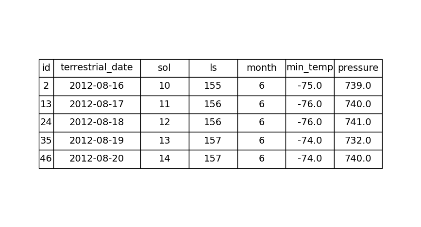
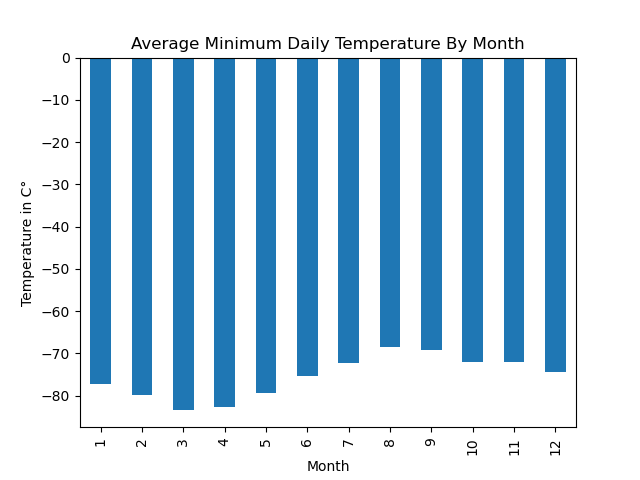

# Module 11 Challenge: Web Scraping and Data Collection

<ins>Project Overview</ins>
-----

For this project, I was able to create two technical products. Firstly, I was able to scrape the titles and previews from Mars news articles and secondly, I was able to scrape and analyze Mars weather data from a table. This project was interesting for a couple reasons, but mostly because it gives an opportunity to put to use the core skills of collecting data, organizing and storing data, analyzing data, and then visually communicating your insights.
    

<ins>Process and Technologies</ins>
-----

*Deliverable #1*

The first part of this project utilized Splinter for automated browsing to access the Mars news site (https://static.bc-edx.com/data/web/mars_news/index.html) and BeautifulSoup for HTML parsing. I created a BeautifulSoup object, `soup_object`, and extracted all the `div` and `class` elements needed in order to add the titles and preview text of the news articles to a list. After confirming the list was successful, I was able to close the broswer.

*Deliverable #2*

The second part to this project scraped and analyzed the data from the Mars Temperature Data Site (https://static.bc-edx.com/data/web/mars_facts/temperature.html) using a BeautifulSoup object to obtain the table and a Pandas DataFrame to hold the data under seven column headings. I first inspected the data types and converted each column to `datetime`, `int`, or `float` data types. With the cleaned data, I was able to create a few bar charts to show the average minimum daily temperature for all of the months on Mars, the average daily atmospheric pressure at the location of the spaceship Curiosity, and about how many terrestrial (Earth) days exist in a Martian year. To finish this part of the project, I saved the Mars DataFrame to a CSV.

    
<ins>Challenges</ins>
-----

The two biggest challenges I have faced in this project was the use of BeautifulSoup and how to most efficiently convert the data types. After creating the `soup_object`, I struggled to rememeber to call the name of the object instead of `soup` itself. Initially I tried to condense the code for the data type conversion to one single line, but since `to_datetime` is a different function than `astype`, I was unable to have a single line of code. Alternatively, I created a dictionary to hold the `int` and `float` columns and used `df = df.astype(convert_dict)` in order to combine the two functions.
